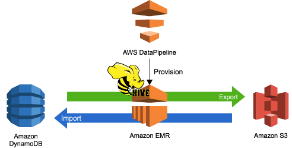
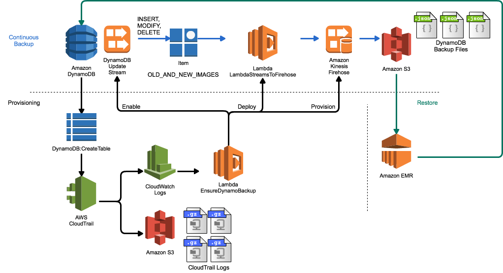

# DynamoDB Continuous Backup Utility

Amazon DynamoDB is a fast and flexible NoSQL database service for all applications that need consistent, single-digit millisecond latency at any scale. For data durability, Tables are automatically distributed across 3 facilities in an AWS Region of your choice, and ensure continous operation even in the case of AZ level interruption of service.

DynamoDB can be [backed up using Amazon Data Pipeline](http://docs.aws.amazon.com/datapipeline/latest/DeveloperGuide/dp-importexport-ddb-part2.html), which creates full point in time copies of DynamoDB tables to AmazonS3. If you want to restore data from a point in time, you simply [reimport that data into a new table](http://docs.aws.amazon.com/datapipeline/latest/DeveloperGuide/dp-importexport-ddb-part1.html).



For some customers, this full backup and restore model works extremely well. Other customers need the ability to recover data at the item level, with a frequency that is much lower than a full periodic backup and restore. For example, they may want to recover changes made to a single item within just a few minutes.

This module gives you the ability to configure continuous, streaming backup of all data in DynamoDB Tables to Amazon S3 via [AWS Lambda Streams to Firehose](https://github.com/awslabs/lambda-streams-to-firehose), which will propagate all changes to a DynamoDB Table to Amazon S3 in as little as 60 seconds. This module completely automates the provisioning process, to ensure that all Tables created in an Account over time are correctly configured for continuous backup. It does this by operating the API calls in your Account.  [Amazon CloudWatch Events](http://docs.aws.amazon.com/AmazonCloudWatch/latest/events/WhatIsCloudWatchEvents.html) subscribes to `DynamoDB::CreateTable` and `DeleteTable ` events and then forwards them to an AWS Lambda function that automates the configuration of continuous backup. This includes:

* Configuring [DynamoDB Update Streams](http://docs.aws.amazon.com/amazondynamodb/latest/developerguide/Streams.html) for the Table that's just been created
* Creating an [Amazon Kinesis Firehose Delivery Stream](http://docs.aws.amazon.com/firehose/latest/dev/basic-create.html) for the required destination of the backups on Amazon S3
* Deploy AWS Lambda Streams to Firehose as a Lambda function in the account
* Route the Table's `NEW_AND_OLD_IMAGES` update stream entries to the LambdaStreamToFirehose function



By using this module, you can ensure that any Amazon DynamoDB Table that is created, whether as part of an application rollout, or just by a developer as they are doing development, has continuous incremental backups enabled. Once this module deployed, there are no ongoing operations needed to create these backups on S3.

When you delete DynamoDB Tables, this automation also ensures that the Kinesis Firehose Delivery Stream is deleted, but the backup data on Amazon S3 is retained.

# How much will it cost?

This solution adds AWS service components to achieve continuous backup of your DynamoDB data. The additional cost will be made up of the following (depending on region prices may vary slightly):

* Adding an update stream to the DynamoDB table. This costs $.02/100,000 reads after the first 2.5M reads per update stream
* Adding a Kinesis Firehose Delivery Stream per table. This costs $.035/GB ingested to the delivery stream
* Backup data storage on S3. This costs the customer ~ $.03/GB
* CloudWatch Events. This costs $1.0/million events.
* AWS Lambda invocations to forward DynamoDB Update Stream data to Kinesis Firehose. This costs $.20/million invocations, after the first million.

We believe that these costs are relatively low, but you should assess the cost implications to running this solution in your account, especially on tables with a very large number of write IOPS.

# Getting Started

## Create the configuration

To get started with this function, simply clone the project, and then create a configuration file. This module uses [hjson](https://hjson.org) to make the configuration easy to maintain and read over time, and there's an example file in [config.hjson](src/config.hjson). You may need to work with your AWS Administrator to setup some of the IAM Roles with the correct permissions. You will only need one configuration for **all** tables in your account, and the following items must be configured:

* `region` - the AWS Region where you want the function deployed
* `cloudWatchRoleArn` - IAM Role ARN which CloudWatch Events will use to invoke your Lambda function
* `firehoseDeliveryBucket` - The S3 bucket where DynamoDB backup data should be stored
* `firehoseDeliveryPrefix` - The prefix on S3 where DynamoDB backup data should be stored. The table name will be added automatically to this prefix, as will the date and time of the backup file
* `firehoseDeliveryRoleArn` - the ARN of the IAM role that Kinesis Firehose will use to write to S3
* `firehoseDeliverySizeMB` - size in MB of dynamo DB backup files to write to S3
* `firehoseDeliveryIntervalSeconds` - output interval in seconds for backup files (minimum of 60)
* `lambdaExecRoleArn` - IAM Role ARN for which AWS Lambda uses to write to Kinesis Firehose
* `streamsMaxRecordsBatch` - Number of update records to stream to the continuous backup function at one time. This number times your DDB record size must be < 128K
* `tableNameMatchRegex` - Regular expression that is used to control which tables are provisioned for continuous backup. If omitted or invalid then it will not be used

An appendix with the structure of the required IAM role permissions is at the end of this document.

# Installing into your Account

In order to deploy this function into your AWS Account, you must first build the Lambda module with the provided configuration, and then deploy it to your account. The module is configured at account level, and runs for all DynamoDB tables created.

## Build the Lambda Function

We now need to build the Lambda function so we can deploy it to your account. This means we need to add the configuration file into the archive that will be run as an AWS Lambda function. To do this, run:

```
cd src
./build.sh <config file name>
```

where `<config file name>` is the file you just created, ideally in the same directory as src. This will install the required modules into the `/lib` folder if they aren't there, and then create a Zip Archive which is used to deploy the Lambda function.


## Deploy to AWS Lambda

Now that the function is built, we need to prepare your account and deploy the Lambda function we've just built. By running:

```
cd src
deploy.py --config-file <config file name>
```

We will:

* Subscribe CloudWatch Events to DynamoDB CreateTable and DeleteTable API Calls
* Deploy the Lambda function
* Subscribe the Lambda function to the CloudWatch Events Subscription
* Enable CloudWatch Events to invoke the Lambda function

## Verify

Once deployed, you can verify the correct operation of this function by:

* Ensuring that there is a CloudWatch Events Rule for `dynamodb.amazonaws.com` for events `CreateTable` and `DeleteTable`
* This CloudWatch Events Rule has a target of the `EnsureDynamoBackup` Lambda function
* Create a simple test DynamoDB table, and observe the CloudWatch Logs output from `EnsureDynamoBackup` indicating that it has provisioned the continuous backup. For example:

```
aws dynamodb create-table --region eu-west-1 --attribute-definitions AttributeName=MyHashKey,AttributeType=S --key-schema AttributeName=MyHashKey,KeyType=HASH --provisioned-throughput ReadCapacityUnits=1,WriteCapacityUnits=1 --table-name MyTestTable
```

This will result in log output such as:

```
START RequestId: 0afc60f9-7a6b-11e6-a7ee-c571d294a8c0 Version: $LATEST
Loaded configuration from config.hjson
Enabled Update Stream for MyDynamoTable
Resolved DynamoDB Stream ARN: arn:aws:dynamodb:eu-west-1:<my account number>:table/MyDynamoTable/stream/2016-09-14T11:04:46.890
Created new Firehose Delivery Stream arn:aws:firehose:eu-west-1:<my account number>:deliverystream/MyDynamoTable
Resolved Firehose Delivery Stream ARN: arn:aws:firehose:eu-west-1:<my account number>:deliverystream/MyDynamoTable
Processed 1 Events
END RequestId: 0afc60f9-7a6b-11e6-a7ee-c571d294a8c0
REPORT RequestId: 0afc60f9-7a6b-11e6-a7ee-c571d294a8c0 Duration: 3786.87 ms Billed Duration: 3800 ms Memory Size: 128 MB Max Memory Used: 51 MB
```

Please note that API Calls => CloudWatch Events => AWS Lambda propagation can take several minutes.

## Activating continuous backup for existing tables

Once you have performed the above steps, continuous backup will be configured for all new Tables created in DynamoDB. If you would like to also provision continuous backup for the existing tables in your account, you can use the `provision_tables.py` script.

First, you need to indicate if you want all tables, or only a subset of tables to be provisioned. You do this with a configuration file:

```
{
  "provisionAll": (true|false),
  "tableNames": [
    "Table1",
    "Table2",
    "...",
    "TableN"
  ]
}
```

This file, like others in the module, uses HJson. By setting `provisionAll` to `true`, the whitelist will be ignored and all Tables in your account will be configured for continuous backup. However, if you do not include the value, or set `false`, then the `tableNames` provided will be used, and only those tables will be configured:

`python provision_tables.py my_table_whitelist.hjson`

You can use the `deprovision_tables.py` script in exactly the same way to tear down the continuous backup configuration.

# Limits

Please note that default Account limits are for 20 Kinesis Firehose Delivery Streams, and this module will create one Firehose Delivery Stream per Table. If you require more, please file a [Limit Increase Request](https://aws.amazon.com/support/createCase?serviceLimitIncreaseType=kinesis-firehose-limits&type=service_limit_increase).

# Backup Data on S3

Data is backed up automatically via Amazon Kinesis Firehose. The Firehose Delivery Stream that is created as part of provisioning will have the same name as the DynamoDB table you create. The output path of the Firehose Delivery Stream will be the configured bucket and prefix, plus the table name, and then the date in format `YYYY/MM/DD/HH`. An example backup file for a variety of options would look like:

```
{"Keys":{"MyHashKey":{"S":"abc"}},"NewImage":{"123":{"S":"asdfasdf"},"MyHashKey":{"S":"abc"}},"OldImage":{"123":{"S":"0921438-09"},"MyHashKey":{"S":"abc"}},"SequenceNumber":"19700000000011945700385","SizeBytes":45,"eventName":"MODIFY"}
{"Keys":{"MyHashKey":{"S":"abc"}},"NewImage":{"123":{"S":"asdfasq223qdf"},"MyHashKey":{"S":"abc"}},"OldImage":{"123":{"S":"asdfasdf"},"MyHashKey":{"S":"abc"}},"SequenceNumber":"19800000000011945703002","SizeBytes":48,"eventName":"MODIFY"}
```

Every change made to the DynamoDB Item is stored sequentially in Amazon S3, using the Date that the Item was forwarded to Kinesis Firehose from the UpdateStream. You may expect a propagation delay of a few seconds between the DynamoDB Item update/insert/delete time, and the forwarding of the event to Kinesis Firehose. Firehose will then buffer data for the configured `firehoseDeliveryIntervalSeconds`.

# Filtering which tables are backed up

By default, all Tables in your account will be configured for backup. If you want to filter this down to a subset, you can supply a `tableNameMatchRegex` which will check the name of the Table created in DynamoDB against the supplied regular expression. If it matches then the Table will get backed up. If you supply an invalid regular expression, or have other issues with the supplied configuration __then the table will be backed up__.

You can also go further by supplying your own code which validates if a Table should be backed up. For instance, you might check a configuration file or database entry, or check other properties such as the number of IOPS. To implement your own function, simply code a new module in `dynamo_continuous_backup.py` that takes a single String argument (the DynamoDB table name) and returns Boolean. Once done, you can register the function by setting it's name as the implementation function [on line 53](src/dynamo_continuous_backup.py#L53):

```
def my_filter_function(dynamo_table_name):
	# custom logic implementation to filter tables in/out of backup
	...
	return (True|False)

optin_function = my_filter_function
```

# Prerequisites for setup & running

In order to use this module, you will need to have installed the following:

* Python
* Boto3
* HJson
* ShortUUID
* aws-cli

Installation of Python & Pip is beyond the scope of this document, but once installed, run:

```
pip install --upgrade boto3 awscli hjson shortuuid
```

and on some systems you may need to run with `sudo`, and on Mac may need to add `--ignore-installed six`.

When running provision/deprovision tables, you will need to provide access credentials which provide at least the following AWS service permissions:

```
"dynamodb:DescribeStream",
"dynamodb:DescribeTable",
"dynamodb:ListStreams",
"dynamodb:ListTables",
"dynamodb:UpdateTable",
"firehose:CreateDeliveryStream",
"firehose:DescribeDeliveryStream",
"firehose:ListDeliveryStreams",
"firehose:DeleteDeliveryStream",
"lambda:AddPermission",
"lambda:CreateEventSourceMapping",
"lambda:GetEventSourceMapping",
"lambda:GetFunction",
"lambda:GetPolicy",
"lambda:ListAliases",
"lambda:ListEventSourceMappings",
"lambda:ListFunctions",
"lambda:UpdateEventSourceMapping",
"lambda:DeleteEventSourceMapping"
```


# Performing a Restore

## Determining which data needs to be restored

The first step in performing a restoration operation is to determine which data must be restored. You can easily review all changes made to a Table Item over time, by running queries via [Amazon EMR](https://aws.amazon.com/emr), using Presto or Hive integration with Amazon S3. First, provision an Amazon EMR Cluster, and ensure that it has Hive and Hue enabled as installed tools. Once up, [connect to Hue](http://docs.aws.amazon.com/ElasticMapReduce/latest/DeveloperGuide/accessing-hue.html) and open a query editor.

The first thing we'll need is a [SerDe](https://cwiki.apache.org/confluence/display/Hive/SerDe) that allows us to read the complex, nested JSON structure that our DynamoDB Update Stream forwards to Kinesis Firehose. The OpenX JSON Serde is excellent for this - to load it into your cluster, [follow the instructions for building the SerDe](https://github.com/rcongiu/Hive-JSON-Serde), upload the generated JAR to S3, and run:

`
add jar s3://mybucket/prefix/json-serde-1.3.8-SNAPSHOT-jar-with-dependencies.jar;
`

We'll now create a Hive Table on top of our backup location, which uses this SerDe to read the JSON and let us query fine grained details. This table will be read-only on our backup data, and you can drop it at any time:

```
create external table MyTable_<YYYY><MM><DD>_<HH>(
	Keys map<string,map<string,string>>,
	NewImage map<string,map<string,string>>,
	OldImage map<string,map<string,string>>,
	SequenceNumber string,
	SizeBytes bigint,
	eventName string)
ROW FORMAT SERDE 'org.openx.data.jsonserde.JsonSerDe'
location 's3://backup-bucket/backup-prefix/MyTable/<YYYY>/<MM>/<DD>/<HH>';
```

Please note that with the above, we'd just be looking at a single hour's worth of backup changes. If you'd prefer to look at a whole day, then you'd just remove the `<HH>` part of the table creation statement and location.

You can then query changes to your table, down to item level, by using the following HQL:

```
select  OldImage['attribute1']['s'],
        NewImage['attribute1']['s'],
        SequenceNumber,
        SizeBytes,
        EventName
from MyTable_<YYYY><MM><DD>_<HH>
where Keys['MyHashKey']['s'] = <some hash key value of the item>
order by SequenceNumber desc;
```

You can add as many different attributes from the item as needed, or use the `NewImage['attribute1']['s']` values in a where clause that matches items that indicate the need for restoration.

## Restoring a DynamoDB Item

This module does not provide any direct function for performing an update to an Item in DynamoDB, simply because we believe there are many many different ways you might want to do this, as well as a likely need for validation and approval to make a manual change to an application table. The above queries give you the ability to see how values were changed over time, and make an educated decision about what the 'restored' values should be, and it is highly likely that these changes should be introduced via the application itself, rather than bypassing application logic and directly updating the database. However, every customer has different requirements, and so please carefully consider the implications of updating your application DB before making any direct changes.

# Appendix 1: IAM Role Permissions

This module requires 3 roles in order to deliver data between CloudTrail, CloudWatch and Amazon Kinesis on your behalf. The following role policies are required, and each minimum set of permissions is shown.

##	cloudWatchRoleArn

IAM Role ARN which CloudWatch Events uses to invoke your AWS Lambda Function.

Trust Relationship: `events.amazonaws.com`

Predefined Policy: `CloudWatchEventsInvocationAccess`

## firehoseDeliveryRoleArn

IAM Role ARN that Kinesis Firehose will use to write to S3. This role must have at least permissions to write to Amazon S3, find buckets, and create log events.

Trust Relationship: `firehose.amazonaws.com`

```
{
  "Version": "2012-10-17",
  "Statement": [
    {
      "Sid": "",
      "Effect": "Allow",
      "Action": [
        "s3:AbortMultipartUpload",
        "s3:GetBucketLocation",
        "s3:GetObject",
        "s3:ListBucket",
        "s3:ListBucketMultipartUploads",
        "s3:PutObject"
      ],
      "Resource": [
        "arn:aws:s3:::<my bucket>",
        "arn:aws:s3:::<my bucket>/*"
      ]
    },
    {
      "Sid": "",
      "Effect": "Allow",
      "Action": [
        "logs:PutLogEvents"
      ],
      "Resource": [
        "arn:aws:logs:eu-west-1:<my account>:log-group:/aws/kinesisfirehose/*:log-stream:*"
      ]
    }
  ]
}
```

## lambdaExecRoleArn

IAM Role ARN for which AWS Lambda uses to write to Kinesis Firehose. This role must have rights to use PutRecords on Kinesis Firehose.

Trust Relationship: `lambda.amazonaws.com`

```
{
    "Version": "2012-10-17",
    "Statement": [
        {
            "Sid": "Stmt1444729748000",
            "Effect": "Allow",
            "Action": [
                "firehose:CreateDeliveryStream",
                "firehose:DescribeDeliveryStream",
                "firehose:ListDeliveryStreams",
                "firehose:PutRecord",
                "firehose:PutRecordBatch",
                "dynamodb:DescribeStream",
                "dynamodb:DescribeTable",
                "dynamodb:GetRecords",
                "dynamodb:GetShardIterator",
                "dynamodb:ListStreams",
                "dynamodb:ListTables",
                "dynamodb:UpdateTable",
                "logs:CreateLogGroup",
	            "logs:CreateLogStream",
	            "logs:PutLogEvents",
	            "lambda:CreateFunction",
                "lambda:CreateEventSourceMapping",
	            "lambda:ListEventSourceMappings",
	            "iam:passrole",
                "s3:Get*",
                "s3:List*"
            ],
            "Resource": [
                "*"
            ]
        }
    ]
}
```

# License

Licensed under the Apache License, 2.0. 
